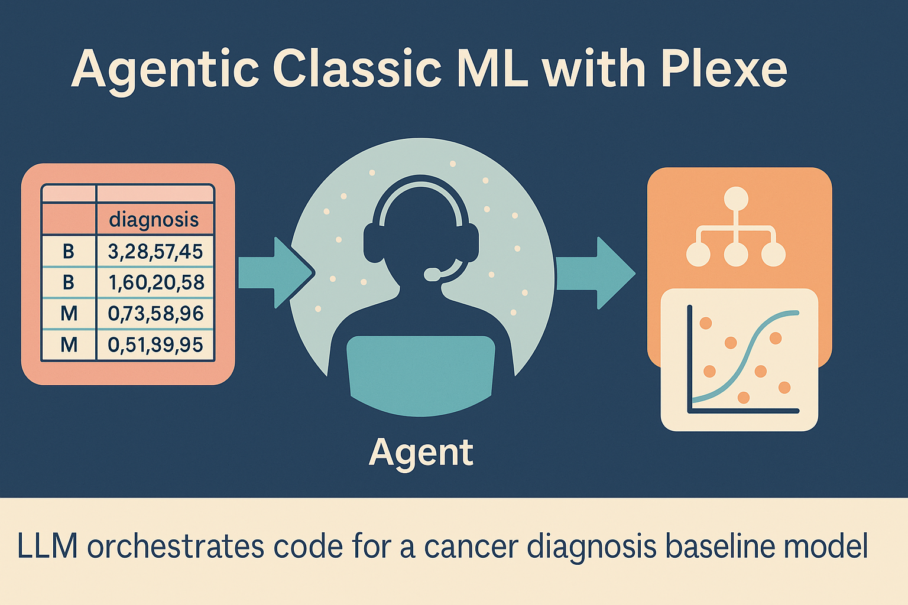
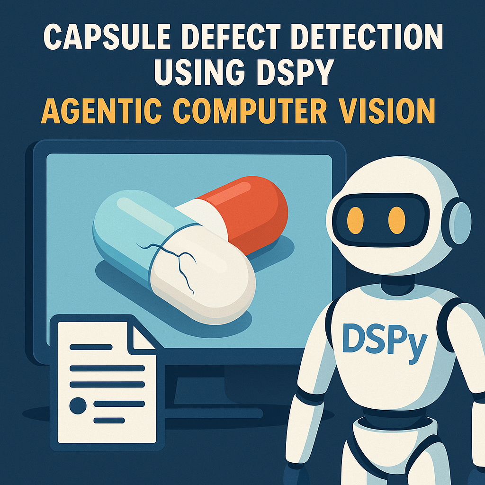
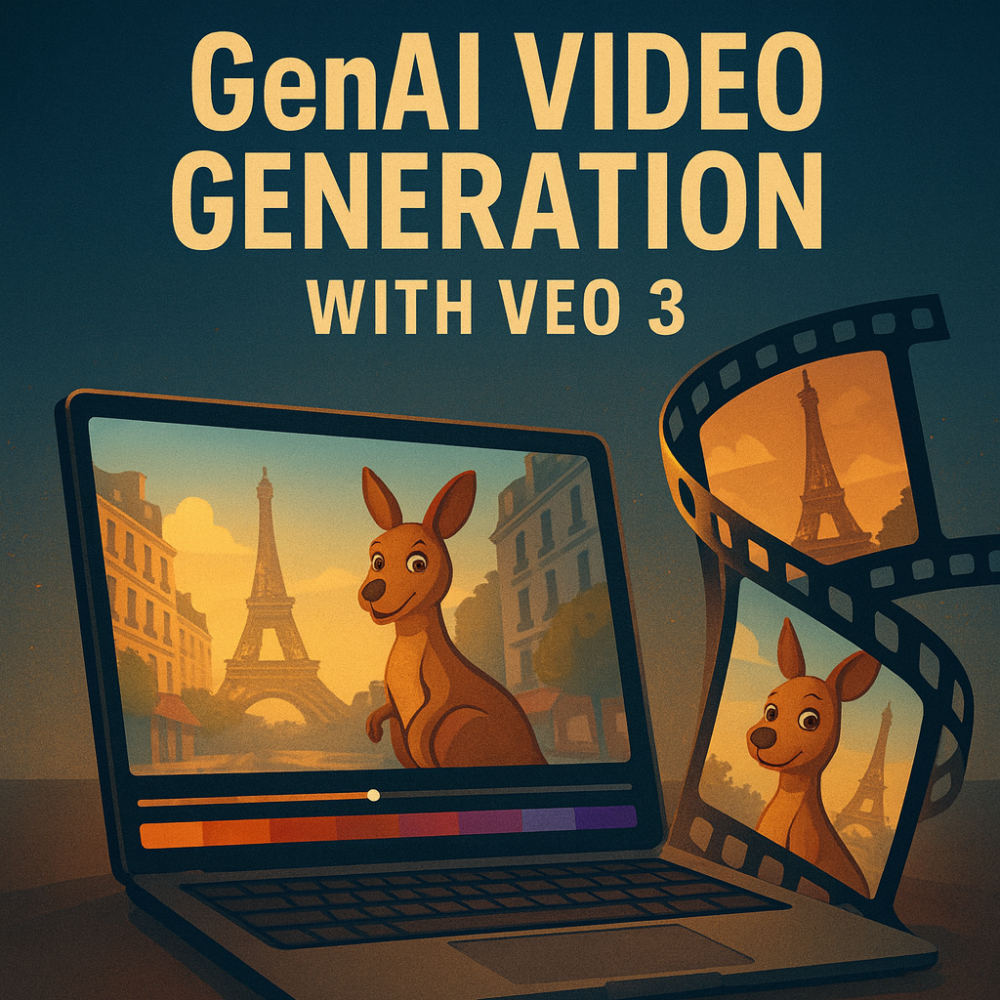

# Agentic AI & GenAI Playground

This repository is a small, curated set of projects I’ve built in my spare time to explore how to use modern **Agentic AI** and **GenAI** tools, concepts and frameworks in practical, real-world settings.

It focuses on:

- Using LLM-driven agents to **design, run, and evaluate end-to-end ML workflows**.  
- Embedding GenAI models into real **data/ML stacks** (classic ML, computer vision, video) instead of one-off demos.  
- **Optimising prompts and agent programs** (e.g. via DSPy/MIPROv2-style) rather than treating prompts as static text.  
- Building **evaluation loops** for agents and models (end-to-end vs component-based evaluations, LLM-as-a-judge).  
- Exploring **current AI engineering tools and patterns** in a fast-moving ecosystem (agent frameworks, multimodal LLMs, and GenAI video).  

Each folder is a self-contained project with its own `README.md`, code, and setup, designed to be read like a real-world pattern rather than a toy example.

---

## Projects

### 1. AgenticClassicML

**Folder:** `AgenticClassicML/`  
**Readme:** [`AgenticClassicML/README.md`](AgenticClassicML/README.md)

**What it is**

An example that uses **[Plexe](https://github.com/plexe-ai/plexe)** (built on top of `smolagents`) to automatically build **classical ML baselines**.

Instead of manually writing the entire pipeline, the project:

- Uses a LLM-powered multi-agent  to:
  - Inspect a real tabular dataset,
  - Generate training and evaluation code in Python,
  - Train simple models (logistic regression, decision trees),
  - Package the pipeline and artifacts into a reusable tarball.
- Constrains the solution to **simple, interpretable models** to create strong, transparent baselines.
- Demonstrates an **LLM-driven AutoML-style workflow**:
  - Data loading and splitting,
  - Agent-driven model building,
  - Prediction and inspection,
  - Artifact creation and reuse.

**Why it matters**

This project is designed to signal:

- Hands-on experience **using agentic frameworks** (Plexe + smolagents) rather than just talking about them.
- A solid foundation in **classic ML** (logistic regression, decision trees, tabular baselines).
- The ability to design and run **LLM-orchestrated workflows** end-to-end (data prep → training → evaluation → packaging).

For details, setup instructions, and code walkthrough, see the dedicated readme:  
➡️ [`AgenticClassicML/README.md`](AgenticClassicML/README.md)

---
### 2. AgenticCV

**Folder:** `AgenticCV/`  
**Readme:** [`AgenticCV/README.md`](AgenticCV/README.md)

**What it is**

An example that uses **[DSPy](https://github.com/stanfordnlp/dspy)** to build an **agentic computer vision classifier** on the MVTec AD *capsule* dataset.

Instead of training a conventional CNN, the project:

- Wraps a multimodal LLM (e.g. `gpt-4o`) in a **Chain-of-Thought DSPy module** to:
  - Inspect capsule images and reason about visual defects,
  - Classify each image into `crack`, `scratch`, `poke`, `faulty_imprint`, `squeeze`, or `good`.
- Uses **MIPROv2** to automatically **optimize the prompt/program**:
  - Baseline Chain-of-Thought model: ~**60%** exact-match accuracy,
  - MIPROv2-optimized program: ~**76%** exact-match accuracy.
- Exports the optimized programs as **JSON files** that capture:
  - The final prompt,
  - The DSPy configuration,
  - The structure of the compiled model.

**Why it matters**

This project is designed to signal:

- Practical experience **using DSPy for agentic CV**, not just calling a vision API once.
- Ability to turn a folder of images into a **structured evaluation pipeline** using `dspy.Example`, stratified splits, and exact-match metrics.
- Familiarity with **program-level optimization** (MIPROv2) to systematically improve LLM-based models and save the resulting configurations for reuse and deployment.

For details, setup instructions, and code walkthrough, see the dedicated readme:  
➡️ [`AgenticCV/README.md`](AgenticCV/README.md)

### 3. GenAIVideoGenerationVeo3

**Folder:** `GenAIVideoGenerationVeo3/`  
**Readme:** [`GenAIVideoGenerationVeo3/README.md`](GenAIVideoGenerationVeo3/README.md)

**What it is**

An example that uses **Gemini 2.5** + **Veo 3** to automatically generate **multi-scene videos** (e.g. vlogs) from a single high-level idea.

Instead of manually editing video or hand-crafting every shot, the project:

- Uses **Gemini 2.5 Pro** to:
  - Expand an idea (e.g. “tourist kangaroo visiting Paris”) into a sequence of structured **scene prompts**,
  - Return scenes as JSON (`Scene` / `SceneResponse`) with both positive and negative descriptions.
- Uses **Veo 3** to:
  - Generate a short **video clip per scene** with cinematic 16:9 framing,
  - Respect style constraints (e.g. realistic, 4K, vlog style).
- Uses **MoviePy** to:
  - Stitch all scene clips together,
  - Produce a final `vlog.mp4` ready to share.

**Why it matters**

This project is designed to signal:

- Practical experience orchestrating **multi-step GenAI video workflows** (text → scenes → clips → merged video).
- Ability to combine **LLM prompt engineering**, **structured JSON outputs**, and **video generation APIs** in a single pipeline.
- Familiarity with real-world tooling such as `google-genai` and `moviepy` to build portfolio-ready GenAI demos (e.g. automated vlogs, short stories, or marketing clips).

For details, setup instructions, and code walkthrough, see the dedicated readme:  
➡️ [`GenAIVideoGenerationVeo3/README.md`](GenAIVideoGenerationVeo3/README.md)

## Structure

As more projects are added, this repo will group them by theme, for example:

- `AgenticClassicML/` – Agent-driven classical ML baselines (Plexe, smolagents, scikit-learn).
- `AgenticXXXX/` – Agentic workflows for other modalities (e.g. image, text, graphs, retrieval, etc.).

Each project is:

- **Self-contained** – its own environment and instructions.
- **Reproducible** – clear setup and run steps.
- **Explainable** – focused readme and rationale for design choices.

---

## How to Use This Repo

- Browse the project folders to find the scenario you care about.
- Start with `AgenticClassicML` if you want a concrete, tabular ML example using Plexe.
- Use these projects as:
  - Portfolio pieces,
  - Starting points for your own agentic workflows,
  - Conversation drivers with teams building Agentic AI / GenAI products.

More projects will be added over time, covering different data types, tools, and deployment patterns.
